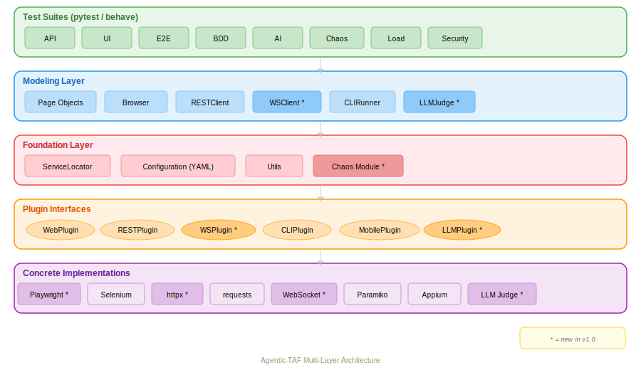

# Agentic-TAF

Agentic Test Automation Framework — an extensible, plugin-based, multi-layered framework for test automation across API, Web UI, WebSocket, CLI, and AI/LLM validation.

Evolved from [PyXTaf](https://pypi.org/project/PyXTaf/) (uiXautomation), modernized for Python 3.12+.

## Architecture

### Multi-Layer Architecture (v1.0)



<details>
<summary>Original PyXTaf architecture (v0.x)</summary>

")
</details>

### Layer Overview

```
┌─────────────────────────────────────────────────────────────────────────┐
│                         Test Suites (pytest / behave)                   │
│  Unit tests (ut/)  │  BDD/ATDD examples (bpt/)  │  Platform (planned)  │
├─────────────────────────────────────────────────────────────────────────┤
│                          Modeling Layer                                  │
│    RESTClient    │    Browser    │    CLIRunner    │    Page Objects     │
├─────────────────────────────────────────────────────────────────────────┤
│                           Plugin Layer                                  │
│  SeleniumPlugin  │  RequestsPlugin  │  ParamikoPlugin  │  AppiumPlugin │
├─────────────────────────────────────────────────────────────────────────┤
│                        Foundation Layer                                  │
│        ServiceLocator  │  Configuration (YAML)  │  Utils               │
└─────────────────────────────────────────────────────────────────────────┘
```

### Plugin Architecture

The framework uses a **ServiceLocator** pattern with pluggable backends. Each plugin type defines an interface; concrete implementations are discovered at runtime via YAML configuration.

**Implemented:**

| Plugin Interface | Implementation | Purpose |
|------------------|----------------|---------|
| `WebPlugin` | `SeleniumPlugin` | Browser automation (Chrome/Firefox, headless supported) |
| `RESTPlugin` | `RequestsPlugin` | REST API testing |
| `CLIPlugin` | `ParamikoPlugin` | SSH / CLI access |
| `MobilePlugin` | `AppiumPlugin` | Mobile automation |

**Planned (T.1.3):**

| Plugin Interface | Implementation | Deps |
|------------------|----------------|------|
| `WebPlugin` | `PlaywrightPlugin` (new default) | `playwright` |
| `RESTPlugin` | `HttpxPlugin` (async) | `httpx` |
| `WSPlugin` (new) | `WebSocketPlugin` | `websockets` |
| `LLMPlugin` (new) | `LLMJudgePlugin` | `langchain-anthropic` |

### Layer Descriptions

**Foundation** (`taf/foundation/`)
- `ServiceLocator` — Plugin discovery and dependency injection via metaclass-based registry
- `Configuration` — YAML-based config with environment variable overrides (`TAF_PLUGIN_<NAME>_<KEY>`)
- `BasePlugin` — Metaclass that auto-registers plugin implementations
- `Utils` — Logger, YAML data model, connection cache, serialization traits

**Modeling** (`taf/modeling/`)
- High-level abstractions that compose plugin capabilities into test-friendly APIs
- `Browser` — Page navigation, screenshot, element interaction (wraps WebPlugin)
- `RESTClient` — HTTP client with JSON encode/decode (wraps RESTPlugin)
- `CLIRunner` — SSH command execution (wraps CLIPlugin)

**Test Suites** (`src/test/python/`)
- `ut/` — 42 framework unit tests (all pass, 0 skipped)
- `bpt/` — BDD/ATDD examples (Bing search, httpbin API)

## Project Structure

```
agentic-taf/
├── src/
│   ├── main/python/taf/                    # Framework core
│   │   ├── foundation/
│   │   │   ├── api/
│   │   │   │   ├── plugins/                # Plugin interfaces
│   │   │   │   │   ├── baseplugin.py       # Metaclass plugin registry
│   │   │   │   │   ├── webplugin.py        # Browser automation interface
│   │   │   │   │   ├── restplugin.py       # REST API interface
│   │   │   │   │   ├── cliplugin.py        # SSH/CLI interface
│   │   │   │   │   └── mobileplugin.py     # Mobile interface
│   │   │   │   ├── ui/                     # UI element abstractions
│   │   │   │   │   ├── controls/           # Button, Checkbox, Edit, etc.
│   │   │   │   │   ├── patterns/           # Invoke, Selection, Toggle, etc.
│   │   │   │   │   └── support/            # Locator, ElementFinder, WaitHandler
│   │   │   │   ├── svc/REST/               # REST client base class
│   │   │   │   └── cli/                    # CLI client base class
│   │   │   ├── plugins/                    # Concrete implementations
│   │   │   │   ├── web/selenium/           # Selenium plugin (Selenium 4, headless)
│   │   │   │   ├── svc/requests/           # requests plugin
│   │   │   │   ├── cli/paramiko/           # Paramiko SSH plugin
│   │   │   │   └── mobile/appium/          # Appium plugin
│   │   │   ├── conf/                       # YAML config + loader
│   │   │   ├── servicelocator.py           # Plugin DI container
│   │   │   └── utils/                      # Logger, YAMLData, traits
│   │   └── modeling/                       # High-level test models
│   │       ├── web/                        # Browser + typed web controls
│   │       ├── svc/                        # RESTClient
│   │       └── cli/                        # CLIRunner
│   │
│   └── test/python/
│       ├── ut/                             # Framework unit tests (42 tests)
│       └── bpt/                            # BDD/ATDD examples
│
├── pyproject.toml                          # Build config + dependencies
├── .github/workflows/ci.yml               # CI: lint → test → build
└── README.md
```

## Installation

```bash
# From source (development)
pip install -r src/main/python/requirements-dev.txt

# Or via pyproject.toml extras
pip install -e ".[dev]"

# Run framework unit tests
PYTHONPATH=src/main/python pytest src/test/python/ut/ -v
```

## Plugin Configuration

Plugins are configured via YAML and discovered by the ServiceLocator at runtime:

```yaml
# taf/foundation/conf/config.yml
plugins:
    web:
        name: SeleniumPlugin
        location: ../plugins/web/selenium
        enabled: true
    cli:
        name: ParamikoPlugin
        location: ../plugins/cli/paramiko
        enabled: true
    REST:
        name: RequestsPlugin
        location: ../plugins/svc/requests
        enabled: true
    mobile:
        name: AppiumPlugin
        location: ../plugins/mobile/appium
        enabled: false
```

Override via environment variables: `TAF_PLUGIN_WEB_ENABLED=false`

## Key Concepts

### ServiceLocator

```python
from taf.foundation import ServiceLocator
from taf.foundation.api.plugins import WebPlugin, RESTPlugin

# Get browser (resolves SeleniumPlugin based on config)
Browser = ServiceLocator.get_app_under_test(WebPlugin)

# Get REST client (resolves RequestsPlugin based on config)
client = ServiceLocator.get_client(RESTPlugin)
```

### Page Object Model

```python
from taf.modeling.web import Browser
from taf.modeling.web import WebButton, WebTextBox

browser = Browser(name='chrome', headless=True)
browser.launch('http://example.com')

txt_search = WebTextBox(id='search_box')
btn_go = WebButton(id='submit_btn')
txt_search.set('test query')
btn_go.click()
```

## History

This project was originally created as **uiXautomation** (PyXTaf) — a Python 2/3 compatible
test automation framework with Selenium, Appium, Paramiko, and Requests plugins. It has been
renamed to **Agentic-TAF** and modernized for Python 3.12+ with Selenium 4 support.

New plugin interfaces (Playwright, httpx, WebSocket, LLM-as-judge) and platform test suites
are planned — see [docs/implementation-plan.md](docs/implementation-plan.md) for the roadmap.

## License

[GNU Lesser General Public License v3.0 (LGPL-3.0)](LICENSE)
